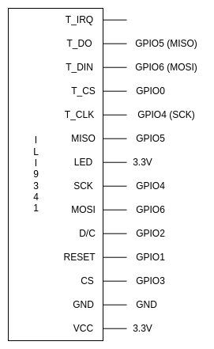

# ThermostatEspNow

This project uses the hardware listed below:  
- ESP32-C3-DevKitM-1 development board  
- SHT30 Wemos shield
- Relay Wemos shield
- 2.4" ILI9341 TFT LCD Screen

## Connection to ILI9341

## Connection to Relay

## Connection to SHT30

## Complete schema
